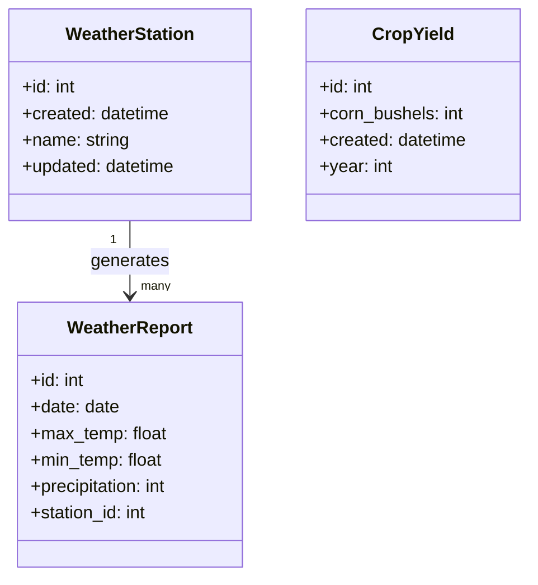

# Code Challenge

## Contents

1. Contents
1. Summary
1. Dependencies
1. Setup
    1. Download Code and Token From GitHub
    1. Set Up AWS Before Creating App
    1. Create App in AWS Elastic Beanstalk
    1. Deploy App in AWS EC2
    1. Notes
1. API
    1. Endpoints
    1. Additional Details
    1. Examples
1. Data Model
1. Future Features
1. Metadata

## Summary

This application retrieves, stores, processes, and accesses data about daily weather and yearly crop yields.

### Deployment

This application ran live on AWS Elastic Beanstalk in July and August 2024, with API usage information at the link below.

http://gconan-corteva-challenge.us-west-2.elasticbeanstalk.com/apidocs

## Dependencies

See `requirements.txt` for full list of dependencies.

1. [Python v3.10+](https://www.python.org/downloads/release/python-31014/)
1. [Python-Poetry](https://python-poetry.org/)
1. [NumPy](https://numpy.org/install/) v2.0.0+
1. [Pandas](https://pandas.pydata.org/pandas-docs/stable/getting_started/install.html) v2.2.2+
1. [Flask-SQLAlchemy v3.1.1+](https://flask-sqlalchemy.palletsprojects.com/en/3.1.x/)
1. [SQLAlchemy v2.0.31+](https://docs.sqlalchemy.org/en/20/intro.html#installation)
1. [PsycoPG2-Binary](https://www.psycopg.org/docs/install.html) v2.9.9+
1. [Dask[dataframe]](https://docs.dask.org/en/stable/install.html) v2024.7.0+
1. [Flasgger](https://pypi.org/project/flasgger/) v0.9.7.1+

## Setup

### 1. Download Code and Token From GitHub

1. Clone this (`Corteva-Challenge`) repository, then select all of its contents and export them as a .ZIP file. Do not just download the repository as a .ZIP file through the GitHub website, because that will put all of the repo contents in a top-level subdirectory within the .ZIP file and cause errors later.
1. [Get a valid GitHub authorization token to access the GitHub API.](https://docs.github.com/en/rest/authentication/authenticating-to-the-rest-api)

### 2. Set Up AWS Before Creating App

1. Open the [AWS Management Console](https://aws.amazon.com/console/) in your browser.
1. Create, or log in to, an AWS account.
1. [Create and download an AWS EC2 key pair.](https://docs.aws.amazon.com/AWSEC2/latest/UserGuide/create-key-pairs.html#having-ec2-create-your-key-pair) I named mine `Corteva-Challenge`.
1. In the IAM page of the AWS Management Console, go to `Roles` and click `Create role`. Under `Use case`, select `EC2`. Click `Next`. On the `Add permissions` page, add the following permissions policies, then click `Next`. 

    - `AmazonS3FullAccess`
    - `AWSElasticBeanstalkRoleWorkerTier`
    - `AWSElasticBeanstalkWebTier`
    - `AWSElasticBeanstalkWorkerTier`

1. Name the role and click `Create role`.
1. [Create an EC2 instance profile](https://docs.aws.amazon.com/codedeploy/latest/userguide/getting-started-create-iam-instance-profile.html) using this role.

### 3. Create App in AWS Elastic Beanstalk

1. Open the the Elastic Beanstalk page in the AWS Management Console.
1. Click `Create application`.
1. Fill in the `Application name`, `Environment name`, and `Domain` fields. For this example, I named my app `Corteva-Challenge` with an environment called `Corteva-Challenge-env` at the subdomain `gconan-corteva-challenge`.
1. In the `Platform` field, select `Python`, and for `Platform branch` select `Python 3.11`.
1. Check `Upload your code` and `Local file`, then click `Choose file` and upload your `.zip` file copy of the `Corteva-Challenge` code repo. Click `Next`.
1. Click `Use an existing service role` and select the default `aws-elasticbeanstalk-service-role`. Under `EC2 key pair`, select the key pair you downloaded earlier. Under `EC2 instance role`, select the role you created earlier.
1. Under `Public IP address`, click the `Activated` box. Also click the `Enable database` switch. Under `Username` and `Password`, type `postgres`.1
1. Under `Environment properties`, click `Add environment property`. Name it `GITHUB_TOKEN` and enter the entire token string you generated.
1. Click `Next`, and on the `Review` page click `Submit` to create the app.

### 4. Deploy App in AWS EC2.

1. Open Amazon RDS in the AWS Management Console. Click `Databases` in the sidebar, then select the database you generated when you created your Elastic Beanstalk application. Under `Connected compute resources`, click `Actions` and click `Set up EC2 connection`. In the `EC2 instance` dropdown, select the EC2 instance running your application, then click `Continue`.
1. From the EC2 page of the AWS Management Console, click `Instances`, and then the string under the `Instance ID` of the instance running your application. Click `Connect`, ensure that `Connect using EC2 Instance Connect` is checked, and then click the `Connect` button at the bottom-right.
1. In the EC2 Instance Connect command-line terminal, run `source /var/app/venv/staging-*/bin/activate`.2 
1. From the Elastic Beanstalk page of the AWS Management Console, click `Environments` and then the env you created (e.g. `Corteva-Challenge-env`). Copy the URL path under `Domain`.
1. From the RDS page of the AWS Management Console, go to `Databases` and then click the database you started for this app. Copy the URI path listed under `Endpoint & Port`.
1. In the EC2 Instance Connect command-line terminal, activate the environment and define its variables.2 In the terminal,
    
    1. Run `ls -d /var/app/venv/staging-*/bin` to get the `bin` directory path.
    1. Run `export PYTHONPATH=` followed by the `bin` directory path.
    1. Run `source ${PYTHONPATH}/activate` 
    1. Run `export GITHUB_TOKEN=` followed by the entire GitHub access token string you generated.
    1. Run `export SQLALCHEMY_DATABASE_URI=postgresql+psycopg2://postgres:postgres@` followed by the database URI path and `:5432/postgres` at the end.
    
1. In the `Elastic Beanstalk > Environments > Corteva-Challenge-env > Configuration` section, define those environment variables again.3 In the `Environment properties` section of the `Configuration` page, 

    1. If there is no environment variable named `GITHUB_TOKEN`, then add one and set its value to the entire GitHub token string.
    1. If there is no environment variable named `PYTHONPATH`, then add one and set its value to the `bin` directory path.
    1. If there is no environment variable named `SQLALCHEMY_DATABASE_URI`, then add one and set its value to the same string `postgresql+psycopg2://postgres:postgres@`{database-URI}`:5432/postgres`.

1. To start the application, connect to its host via EC2 Instance Connect and then do the following:
    1. `cd` to the directory containing `app.py`. That file should be in a subdirectory of `/var/app/current/`.
    1. Run `flask setup-db`.2
    1. Load all data into the database by running `flask load-data`.2
1. The application should now be fully usable. Navigate to the domain path URL you copied earlier in your browser, and you should be able to access any of the API endpoints defined below as subdomains.

### Notes

In a full production deployment used by actual clients, I would write the app to:

1. use a secure username and password, and require user authentication to access the application.
2. run its setup steps automatically. For this test deployment, I do them manually.
3. ensure that environment variables are passed between Elastic Beanstalk and the EC2 instance terminal. Currently, environment variables must be defined both places.

## API

### Endpoints

- `/` returns a simple message stating whether the application is running.
- `/apidocs` uses Flasgger to provide additional information on this application's API endpoints and what data they allow you to access.
- `/api/crop` returns crop yield data: the number of crop bushels per year.
- `/api/weather` returns daily weather report data: the daily maximum/minimum temperature and precipitation at each weather station. This endpoint accepts several parameters to filter the data:
    - `station_id=N` will only include reports from the weather station with the ID number N. 
    - `max_date=YYYY-MM-DD` will exclude any reports *after* the specified date [in ISO 8601 format](https://www.iso.org/iso-8601-date-and-time-format.html).
    - `min_date=YYYY-MM-DD` will exclude any reports *before* the specified date [in ISO 8601 format](https://www.iso.org/iso-8601-date-and-time-format.html).
- `/api/weather/stats` returns overall weather report data: the average minimum/maximum temperature and total precipitation at a given station during a given year
    - `station_id=N` will only include reports from the weather station with the ID number N. 
    - `year=YYYY` will only include stations' reports for the year YYYY.
- `/api/weather/stations` returns the name and ID number of every weather station.

### Additional Details

- The `/api/weather`, `/api/weather/stations`, and `/api/crop` endpoints return paginated results. They accept two parameters to filter results by page:
    - `per_page=N` organizes results into groups of N. By default, it will return the first N results.
    - `page=N` will return the Nth page/group. By default, it will return the Nth 50 results.

### Examples

#### `/api/weather`

Navigate to this API endpoint to access the twentieth to fourtieth daily weather reports from 1997 at station 5:

`/api/weather?page=2&per_page=20&min_date=1997-01-01&max_date=1997-12-31&station_id=5`

#### `/api/weather/stats`

Navigate to this API endpoint to access the average yearly maximum/minimum temperature and total precipitation at weather station 3 in 1998:

`/api/weather/stats?station_id=3&year=1998`

## Data Model

## Future Features

The following are not currently features of this application, but I would add them if implementing it for production-level use by actual clients.

- **Add Yearly Statistics Class/Model.** Explicitly define a SQL database table, and corresponding Python class in `models.py`, to store the yearly statistics returned from the `/api/weather/stats` endpoint.
- **User Authentication.** Instead of allowing data access to anyone who can access the page, the application could require user authentication.
- **Scheduled Data Ingestion.** The application could query the source data files and update its database at specified intervals, like on a `cron` job. 
- **Statistical Predictive Modeling.** The application could use daily weather reports to predict and yearly crop yield. In its most basic form, the application would correlate the data columns of the `weather_report` table in a given year with the `corn_bushels` yield for that year. Further models would identify which stations and periods of time best predict the yield.
- **Filtering By Station Name.** Instead of accepting the arbitrary `station_id` parameter, the `/api/weather` endpoint could accept a `station_name` parameter and determine the ID number of that station by `SELECT`ing that `station_name` in the `weather_station` table.

## Metadata

- Written 2024-07-15 by @GregConan (gregmconan@gmail.com)
- Updated 2024-11-24 by @GregConan (gregmconan@gmail.com)
